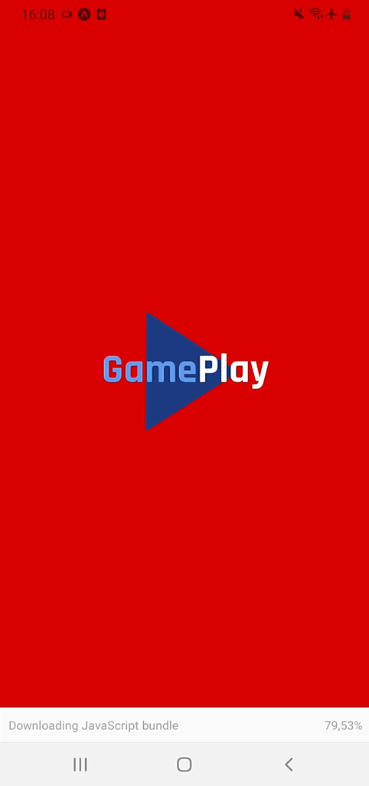

# Gameplay

Projeto criado durante a NLW Together 6ª Edição da Rocketseat.

Aplicativo mobile utilizando REACT NATIVE.

Aplicativo para agendamento de jogos entre amigos através do Discord.

A integração com Discord é feita utilizando OAuth2 e JWT.

Nas aulas, foi utilizado ambiente de desenvolvimento diretamente no sistema operacional do computador mas, neste projeto, também há a opção de trabalhar com Docker.

<br>

<p style="float:left">
  
  
  
  
</p>

<br><br>


<p style="float:left">
  
  
  
  
</p>

<br><br>


# Requisitos

- Sem utilizar Docker:
  - Git
  - NodeJS
  - Expo
  - Yarn
  - Expo Go no smartphone

- Utilizando Docker
  - Git
  - Docker Engine
  - Docker Compose
  - Expo Go no smartphone

- Criar uma aplicação no ambiente de desenvolvimento do Discord:
  ```
  https://discord.com/developers/applications
  ```
  - No ambiente OAuth2 da aplicação criada, está o Client ID gerado e onde pode ser cadastrada a URI de Redirecionamento:
  

<br>

# Instalação, Configuração, Execução

- Faça o clone do repositório para seu ambiente de desenvolvimento:
  ```
  git clone https://github.com/johnny0408/gameplay.git
  ```

- Acesse a pasta do projeto:
  ```
  cd gameplay
  ```

- Apenas se não estiver utilizando Docker:

  - Instale as dependências, execute o comando:
    ```
    yarn
    ```

- Apenas para quem utiliza Docker:


  - Abra o arquivo docker-compose.yml e altere o valor do parâmetro REACT_NATIVE_PACKAGER_HOSTNAME com o IP do seu ambiente de desenvolvimento:

    ```
    REACT_NATIVE_PACKAGER_HOSTNAME=SEU_IP
    ```
    - Para encontrar o valor do seu IP digite ipconfig no Windows ou ifconfig no Linux ou Mac.

  - Faça build do contêiner, inicie o contêiner e inicie o aplicativo:

    ```
    docker-compose up --build
    ```

- Crie o arquivo com as variáveis de ambiente:

  - no bash:
    ```
    cp .env.example .env
    ```

  - No powershell:
    ```
    Copy-Item -Path .env.example -Destination .env
    ```


- Preencha os valores das variáveis de ambiente no arquivo .env :
    - REDIRECT_URI=
      - URI de Redirecionameneto cadastrada na aplicação do Discord
    - SCOPE=
      - Recursos que o Discord vai permitir que o APP acesse
        ```
        identify%20email%20connections%20guilds
        ```
    - RESPONSE_TYPE=
      ```
      token
      ```
    - CLIENT_ID=
      - ID do Cliente gerado pela aplicação cadastrada no Discord
    - CDN_IMAGE=

      ```
      https://cdn.discordapp.com
      ```
<br>

- Para quem não utiliza Docker:

  - Inicie o aplicativo:
     ```
     expo start
     ```

  - Acesse `http://localhost:19002`


<br>

- Para quem utiliza Docker:

  - Acesse `http://SEU_IP:19002`

<br>

- Altere o tipo de conexão para Túnel.

<br>

- Acesse o Expo Go no smartphone e leia o QR Code mostrado no browser do computador
